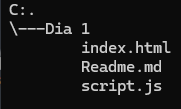

# JavaScript 

Desarrollo de ejemplos de funciones de tipos de variables.

## Descripción 

La página consta de:

1. Ejercicio 1: Donde ingrese la edad y le reste el año de nacimiento.
2. Ejercicio 2, ejercicio 3: Donde ingrese datos y le arroje un resultado en fahrenheir y un descuento.
3. Tipos de variables: Var, Let, Const.
4. Parametros: Parametro sin retorno, parametro con retorno, sin parametro sin retorno.

## Tecnologías utilizadas 

| Python |
|--|
|  |

## Estructura del proyecto 

Aquí podras observar todo lo utilizado para desarrollar el proyecto: 

## Caracteristícas 

* Archivo[index.html]:Consta del código para poder abrir el archivo a ejecutar.
* Archivo[script.js]:Consta del código principal del proyecto.
* Archivo[Readme.md]:Documentación de la estructura del código principal.

## Diseño

El diseño se realizo con el fin de que la página pueda ser utilizada por cualquier usuario y la pueda entender.

## Instrucciones 

1. Clonar el repositorio cargado en GitHub.
2. Abrir en la nube el archivo Python.

## Desarrollado por
Realizado por Yessica Andrea Perez Machuca estudiante de Campuslands como trabajo de JavaScript y Python.